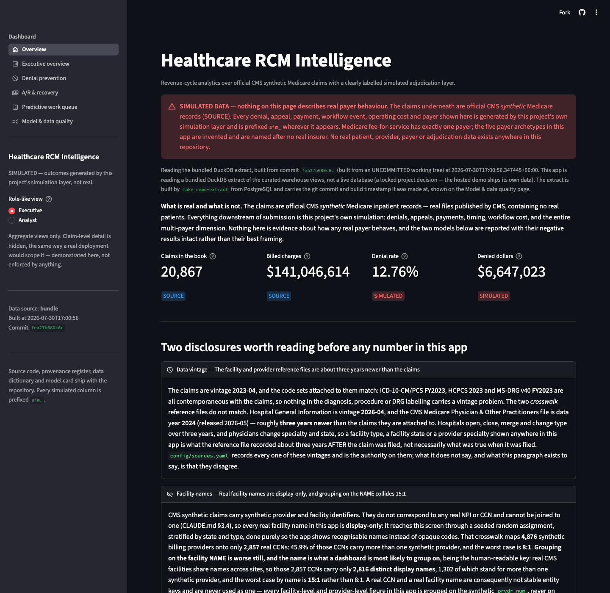
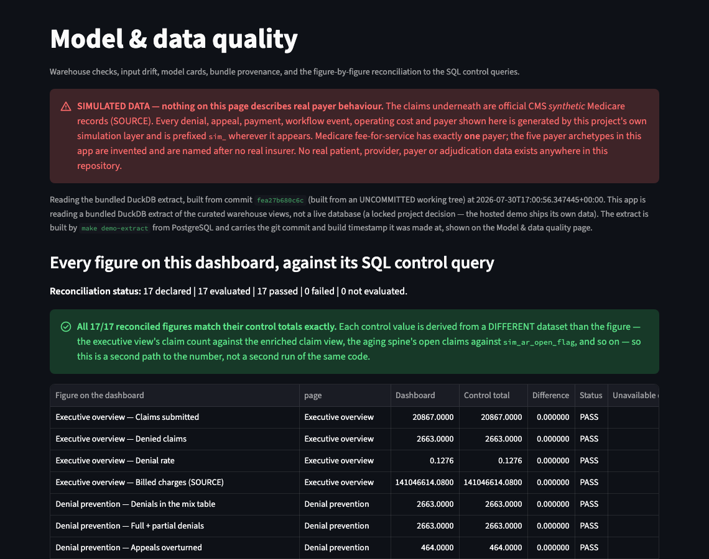
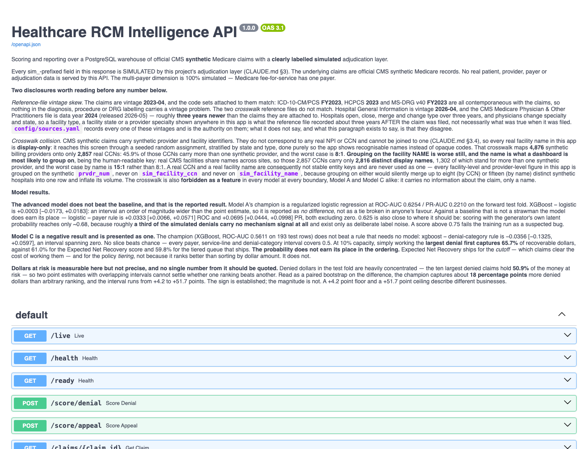
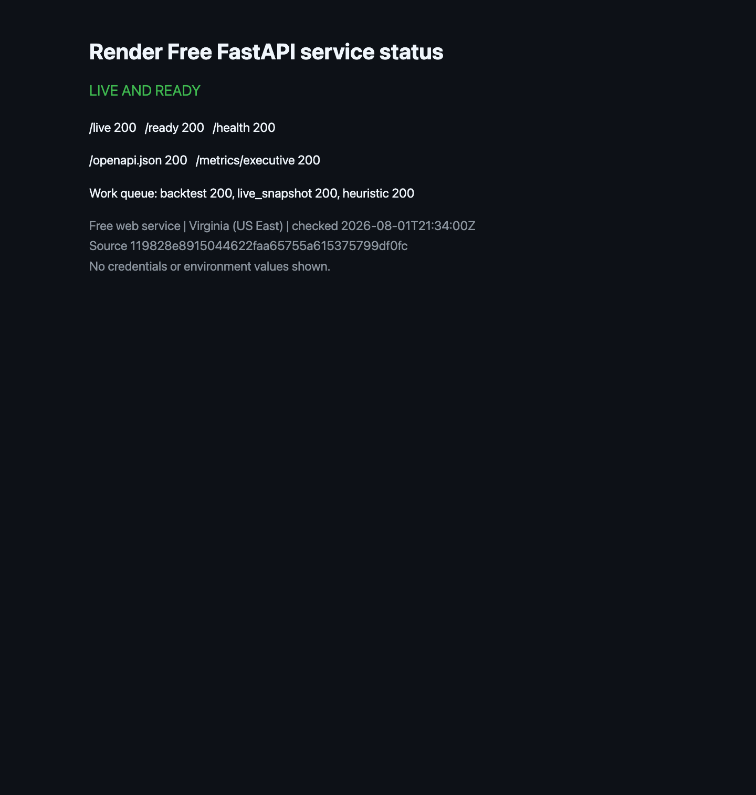
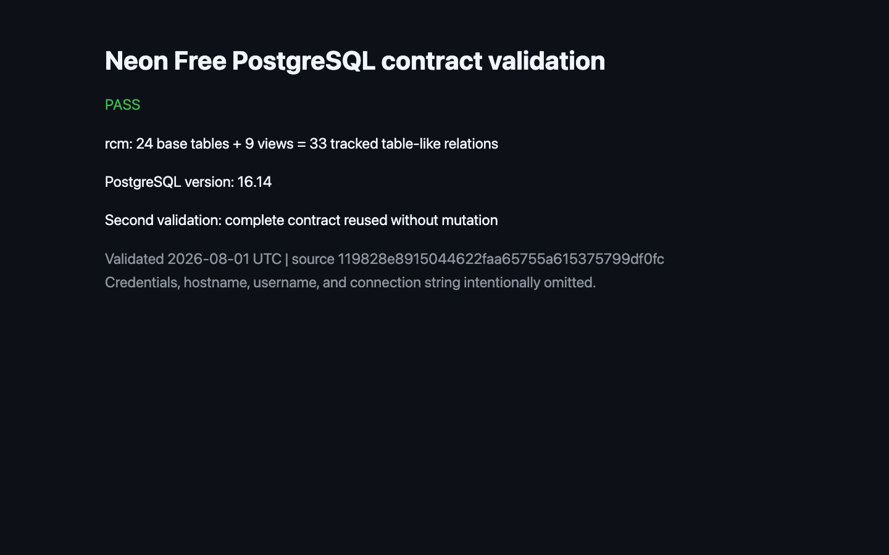

# Zero-Cost Hosted Deployment

This guide records the independently QA-accepted zero-cost portfolio deployment
on Neon Free, Render Free, and Streamlit Community Cloud. The public services
serve the final clean-SHA DuckDB artifact. This remains portfolio-scale hosting,
not a production or always-on deployment.

## Public services

| Surface | Public URL |
|---|---|
| Dashboard | <https://3a3xhz4rrshqdjapzwflxg.streamlit.app/?embed=true> |
| API | <https://healthcare-rcm-intelligence-api.onrender.com> |
| API documentation | <https://healthcare-rcm-intelligence-api.onrender.com/docs> |
| API liveness | <https://healthcare-rcm-intelligence-api.onrender.com/live> |
| API readiness | <https://healthcare-rcm-intelligence-api.onrender.com/ready> |

The current services deploy from `main`. The screenshot evidence was captured
from the pre-release deployment branch at source SHA
`119828e8915044622faa65755a615375799df0fc` on 2026-08-01; it remains historical
free-tier portfolio evidence, not proof of production availability.

## Architecture

- **Neon Free PostgreSQL:** the initialized `rcm` schema, 24 base tables, and 9
  published views. It contains no patient data and is not presented as a populated
  model warehouse.
- **Render Free:** the existing FastAPI application at `src.api.main:app`. It
  serves the committed DuckDB bundle and requires Neon contract validation for
  readiness.
- **Streamlit Community Cloud:** the existing `dashboard/app.py`. It reads the
  same committed DuckDB bundle directly; it does not silently switch to Neon or
  depend on the API for page data.

The default artifact remains `dashboard/demo_data/rcm_demo.duckdb`, pinned by
`RCM_DEMO_BUNDLE_SHA256`. Credentials belong only in provider environment or
secret controls.

## Neon initialization

Create a dedicated Free project, obtain its SSL-required connection string, and
place it directly in the invoking shell or provider secret control. Never write
it to this repository.

```bash
DATABASE_URL="<set outside git>" uv run python scripts/initialize_hosted_postgres.py
DATABASE_URL="<set outside git>" uv run python scripts/initialize_hosted_postgres.py
```

The first command initializes only when the `rcm` schema is absent. The second
validates and reuses the complete schema. An empty or partial existing `rcm`
schema fails without applying the drop-and-recreate DDL. Both runs print only the
PostgreSQL version and non-secret object counts.

## Render Free API settings

Create one **Web Service** from `main` with:

| Setting | Value |
|---|---|
| Runtime | Python |
| Region | Virginia |
| Instance type | Free |
| Build command | `uv sync --frozen --no-dev` |
| Start command | `uv run --no-sync uvicorn src.api.main:app --host 0.0.0.0 --port $PORT` |
| Health check | `/ready` |
| Auto-deploy | On for the selected branch |

Set these environment values in Render, not in git:

| Name | Value |
|---|---|
| `DATABASE_URL` | Neon connection string, including required SSL parameters |
| `RCM_DATA_SOURCE` | `bundle` |
| `RCM_REQUIRE_POSTGRES_READY` | `true` |
| `RCM_DEMO_BUNDLE_SHA256` | SHA-256 of the committed approved bundle |

The in-repository bundle path is the default, so `RCM_DEMO_BUNDLE` does not need
an override. The dashboard performs no browser-side API requests, so a permissive
CORS policy is neither required nor enabled.

Render Free has 512 MB RAM and sleeps after 15 minutes without inbound traffic.
The first request after sleep can take about a minute. The service is portfolio
evidence, not production or always-on infrastructure. Do not use uptime pingers
to evade the free-plan limits.

## Streamlit Community Cloud settings

Create one public app with:

| Setting | Value |
|---|---|
| Repository | `aniketgauba67/healthcare-rcm-intelligence` |
| Branch | `main` |
| Entrypoint | `dashboard/app.py` |
| Python | 3.11 |

Community Cloud discovers the committed `uv.lock` and installs the locked
environment. No Streamlit secret is required for the supported bundle-backed
dashboard. Do not commit `.streamlit/secrets.toml`.

## Current release state

### Hosted validation

- Neon Free, AWS US East 1: PostgreSQL 16.14; one `rcm` schema; 24 base tables;
  9 views; all required relation types, sentinel columns, and published-view
  queries passed. A second run validated and reused the complete contract without
  mutation.
- Render Free: `/live`, `/ready`, `/health`, `/openapi.json`,
  `/metrics/executive`, and the `backtest`, `live_snapshot`, and `heuristic`
  work-queue modes returned HTTP 200 at 2026-08-01T21:34:00Z.
- Streamlit Community Cloud: the public app and process-health endpoint returned
  HTTP 200. Overview and all five dashboard pages rendered without a visible
  exception. Each page retained the synthetic-data banner and disclosures.
- Model & Data Quality reported `17 declared | 17 evaluated | 17 passed | 0
  failed | 0 not evaluated` against the populated committed DuckDB bundle.

### Screenshot manifest

Every screenshot was captured on 2026-08-01 from source SHA
`119828e8915044622faa65755a615375799df0fc`. Provider credentials, database
hostnames, account identifiers, and secrets are intentionally absent.

| File | Public surface | Backend | Synthetic banner | Simulated-derived fields visible |
|---|---|---|---|---|
| `api-openapi.png` | FastAPI Swagger UI | DuckDB + Neon readiness | API disclosure | Schema descriptions |
| `api-readiness.png` | Render API `/ready` | DuckDB + Neon readiness | API notice | Bundle/model metadata |
| `render-service-status.png` | Non-secret summary of public HTTP probes | Render Free | N/A | No |
| `neon-schema-contract.png` | Non-secret summary of actual validation output | Neon PostgreSQL | N/A | No |
| `streamlit-application-status.png` | Streamlit process health | Streamlit Community Cloud | N/A | No |
| `streamlit-overview.png` | Dashboard overview | DuckDB | Yes | Yes |
| `streamlit-executive-overview.png` | Executive Overview | DuckDB | Yes | Yes |
| `streamlit-denial-prevention.png` | Denial Prevention | DuckDB | Yes | Yes |
| `streamlit-ar-recovery.png` | A/R Recovery | DuckDB | Yes | Yes |
| `streamlit-work-queue.png` | Work Queue | DuckDB | Yes | Yes |
| `streamlit-model-data-quality.png` | Model & Data Quality | DuckDB | Yes | Yes |
| `streamlit-reconciliation-17-of-17.png` | 17/17 reconciliation | DuckDB | Yes | Yes |











### Free-tier limitations and release status

Render Free may sleep after inactivity, so its first request can take about a
minute. Streamlit Community Cloud and Neon Free also provide portfolio-scale,
best-effort availability rather than production service guarantees. No paid
resource, payment method, paid disk, paid database, paid instance, or custom
domain is used.

Phase 5 is independently QA-accepted. That acceptance was granted on the final
clean-SHA artifact `66456ebf` from source SHA `ab2aa415`, after local
clean-clone, artifact, and public hosted checks all passed.

The bundle pinned today is
`559022e2fc27461fb874294eca1a6ba39149367afe7b2e49f9b43c2ccc7e8896`, records
source SHA `01b1a623b22a5d3295087ace8995025ced0d462d`, and reports
`git_tree_dirty=false`. It is the same pipeline and the same figures with the
bundle-column `sim_` marker rename applied. It has NOT yet been re-accepted by
QA or re-validated against the public hosted demo, so the hosted services may
still be serving the previous artifact until they are redeployed.
